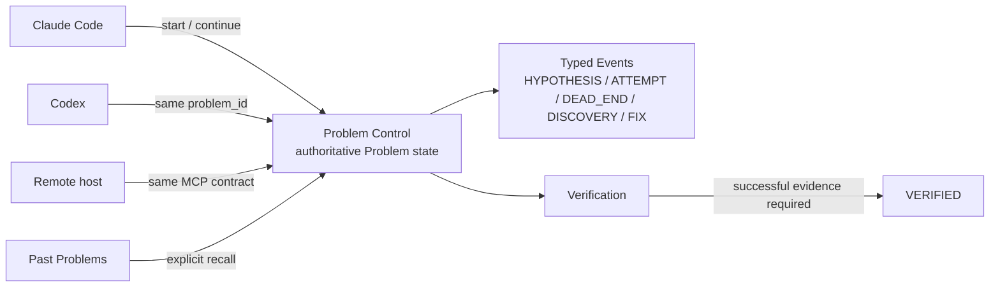

# AI Problem-Solving Memory

English | [日本語](README.md)

AI Problem-Solving Memory is a **Problem Control / Consistency Layer** for AI coding agents.

It is not a generic chat-memory system.

The goal is to let multiple AI hosts continue the **same problem** with the same authoritative state,
typed evidence, failed attempts, discoveries, fixes, and verification history.



**The unit of continuity is the Problem, not the conversation transcript.**

> **Why is it designed this way?** Read the [Owner Decision Log](docs/OWNER_DECISIONS.en.md).  
> It explains why server state is authoritative, why FIX and Verification are separate, why recall is explicit, and why Memory failure must not stop the caller's main work.

## What problem does it solve?

AI-assisted development often loses continuity across sessions and models:

- yesterday's agent tried three approaches, but today's agent does not know which two were dead ends
- a similar issue was solved in another project, but the current agent starts from zero
- an agent says "fixed", but the verification was never actually run
- two agents update the same problem at the same time and silently overwrite state
- retries create duplicate records

AI Problem-Solving Memory treats the **problem itself** as the persistent object.

A Problem can accumulate typed records such as:

- `HYPOTHESIS`
- `ATTEMPT`
- `DEAD_END`
- `DISCOVERY`
- `FIX`
- independent `Verification` evidence

The next AI can continue from that state instead of copying an entire prior conversation.

## Core principles

### Server state is authoritative

Problem identity and state are not accepted from model self-report alone.

Local session bindings are hints and are revalidated against the server.
If the current project or Problem cannot be resolved safely, the system fails closed instead of writing to a guessed target.

### FIX is not Verification

A `FIX` event means a change was proposed or implemented.

It does **not** mean the problem is proven solved.

Verification is a separate entity.
A Problem cannot transition to `VERIFIED` without successful Verification evidence.

### Explicit recall, not an automatic oracle

Past experience is retrieved through an explicit `recall_similar_experience` tool call.

Memory can return:

- relevant past problems
- recorded dead ends
- verification history
- environment information
- evidence-backed successful directions

It does not decide that an old solution is automatically correct for the current problem.

### Memory failure must not stop the main task

Memory is an auxiliary system.

If the Memory service is unavailable, the caller's main work should continue.
Durable client-side queuing preserves writes for retry rather than making the coding task fail because Memory is down.

### Retry-safe writes

A logical write keeps the same `client_event_id` across queueing and retry.

Transport may be at-least-once, while the Memory effect remains idempotent.

## Current host integrations

| Host | Path | Status |
|---|---|---|
| **Claude Code** | local MCP plugin | used and accepted in real workflows |
| **Codex** | same MCP core / same Problem state | accepted in an installed host; can continue a Problem started in Claude Code |
| **Claude.ai** | remote MCP (Streamable HTTP + bearer) | accepted in a real host; remote-only limitations are enforced |
| **ChatGPT** | remote MCP-compatible design | full-write acceptance is **not completed / deferred** |

All supported local / remote paths use the same core tool contract.
There is no separate "Claude memory" and "Codex memory".

## MCP tool surface

The public tool surface is intentionally small:

| Tool | Purpose |
|---|---|
| `current_problem` | Resolve what Problem this session is working on, or what needs to be decided first |
| `continue_problem` | Continue an already-open Problem |
| `resume_problem` | Resume a paused Problem |
| `start_problem` | Start a new Problem |
| `recall_similar_experience` | Retrieve relevant past experience for the current Problem |
| `add_event` | Append a typed HYPOTHESIS / ATTEMPT / DEAD_END / DISCOVERY / FIX / USER_CORRECTION |
| `add_verification` | Record a verification attempt and result |
| `mark_fix_candidate` | Move an investigating Problem to FIX_CANDIDATE |
| `close_problem` | Conclude or pause while preserving verification and optimistic-lock rules |

The model does not choose arbitrary Project / Problem ids for current-Problem actions.
Target resolution comes from host context plus server revalidation.

## Retrieval

The core retrieval layer works **without a paid AI provider**.

### Tier 0 — always available

Deterministic lexical retrieval is built from canonical Memory data.

It can return past problems from other projects and includes the evidence needed to judge whether the old experience is still relevant.

If strict lexical search returns zero candidates, one controlled relaxation may be attempted.

### Optional semantic stages

If a provider is configured, semantic embedding search and structural reranking can augment retrieval.

If that provider is missing or unavailable:

- canonical Memory remains available
- Tier 0 remains available
- only the optional stage degrades

Provider failure does not redefine the canonical state.

## Verification boundaries

A host may only record verification it could actually have performed.

For example, a remote host that has no grounded access to the user's local test runner cannot create a local "tests passed" Verification as if it observed that result.

The definition of evidence is not weakened just because the host is remote.

## Concurrency and consistency

The project includes consistency mechanisms such as:

- optimistic version checks
- typed state transitions
- idempotent event writes
- server-side Problem authority
- stale-binding revalidation
- owner scoping
- explicit verification gates

The intent is not to make agents autonomous.
The intent is to make shared problem state **harder to silently corrupt**.

## Problem Control is not Agent Runtime

This repository deliberately does not become an agent orchestrator.

It does not own:

- which model should run next
- task scheduling
- workflow execution
- agent spawning
- approval routing for every external action

It owns:

- Problem identity
- state
- typed evidence
- verification
- retrieval material
- consistency rules

The execution runtime and the Problem record remain separate responsibilities.

## Quick start for Claude Code

Two pieces are required:

1. the AI-side plugin
2. the Memory service

Install the plugin:

```bash
claude plugin marketplace add nikotaronosuke/ai-problem-solving-memory
claude plugin install problem-solving-memory@ai-problem-solving-memory
```

Run your own Memory service from this repository, then provide the connection settings:

- `MEMORY_API_TOKEN` — credential for your Memory service
- `MEMORY_API_URL` — optional URL; local defaults apply when omitted

The plugin does not create credentials for you.

If Memory is not configured, the tools return a typed `MEMORY_NOT_CONFIGURED` result instead of pretending to continue normally.

For local service setup, database initialization, and development details, see [docs/development.md](docs/development.md).

## Privacy and ownership

The system is owner-scoped.

Design goals include:

- one owner cannot read another owner's Memory
- read-disabled Problems are not silently exposed through retrieval
- current project / Problem resolution does not trust model-supplied identity
- sensitive-provider paths are guarded before external calls
- optional provider failure does not destroy local canonical Memory

The repository does not provide a hosted shared Memory service.

## Why the repository contains so many explicit boundaries

This project was built around a recurring failure mode in AI-assisted development:

> a useful automation layer gradually starts deciding things it cannot actually know.

Several features were intentionally rejected or constrained for that reason.

Examples:

- old Memory is evidence, not present truth
- FIX is not proof
- local bindings are not authority
- semantic retrieval is optional, not canonical
- automatic recall is not the default
- remote hosts cannot claim local execution evidence
- Memory outages do not own the caller's main workflow

For the reasoning and evidence links, see:

- [Owner Decision Log](docs/OWNER_DECISIONS.en.md)
- [Original Japanese Owner Decision Log](docs/OWNER_DECISIONS.md)
- [Retrieval design](docs/retrieval.md) *(Japanese)*
- [Development guide](docs/development.md)

## Development status

This is a working engineering project, not a hosted consumer service.

Some host integrations have real acceptance evidence; others are explicitly marked incomplete.
The README intentionally distinguishes implemented, accepted, deferred, and unsupported behavior.

## AI-assisted development

The implementation was developed with AI coding and research tools.

Product boundaries, state semantics, evidence rules, acceptance criteria, and final trade-off decisions are owned by the project owner.

## License

MIT. See [LICENSE](LICENSE).
